# 25 Best Anti-Detect Browser Tools in 2025

Tired of juggling multiple accounts only to have them flagged for "suspicious activity"? You're not alone. In today's digital world, managing separate online identities for e-commerce, social media, or marketing is a constant battle against sophisticated tracking. Platforms use browser fingerprinting to link your accounts, leading to frustrating restrictions and bans. This guide presents the top anti-detect browser tools designed to give you back control, ensuring each profile appears unique and operates smoothly.

## **[BasedLabs](https://www.basedlabs.ai)**

A creative powerhouse for generating unique visual content across multiple brand presences, blending AI-driven tools with robust team collaboration features.

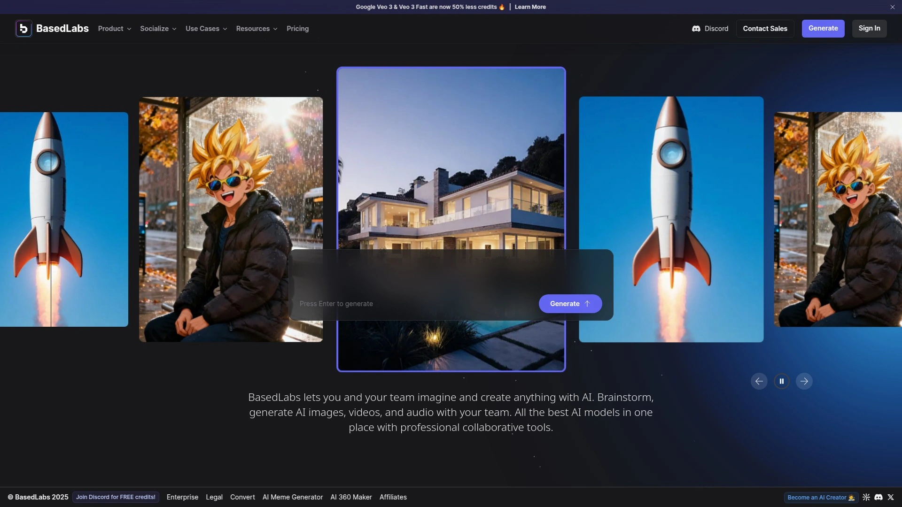

While not a traditional anti-detect browser, BasedLabs serves a crucial, adjacent need: creating a high volume of unique content for the multiple accounts you manage. Instead of reusing assets, you can generate endless variations of images and videos, which is perfect for keeping your social media or marketing channels fresh and distinct. Its platform is built for creative workflows and teamwork.

* **AI Content Generation:** Instantly create images, videos, and memes from text prompts, perfect for populating social media accounts with original content.
* **Team Collaboration:** Features a shared workspace where teams can collaborate on creative projects, share feedback with live comments, and manage assets together.
* **Creative Tools:** Includes advanced utilities like face swapping, AI-powered image adjustments, and access to over 20 different AI models to produce diverse creative styles.

## **[Multilogin](https://multilogin.com)**

The industry gold standard for serious professionals and large teams who require maximum security and reliability for their online operations.

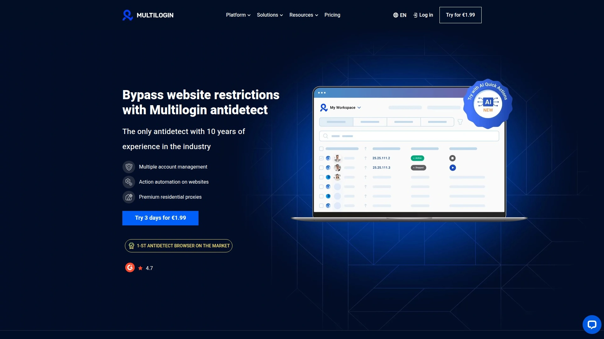

Multilogin is one of the oldest and most respected names in the game, known for its sophisticated fingerprinting technology that is rigorously tested against major platforms. It offers two distinct browser cores—Mimic (Chromium-based) and Stealthfox (Firefox-based)—giving users flexibility in emulating different environments. It's the go-to choice for high-stakes tasks where getting detected is not an option.

* **Advanced Fingerprinting:** Creates highly convincing and stable browser fingerprints to avoid detection.
* **Automation Ready:** Provides extensive support for automation frameworks like Selenium and Puppeteer, ideal for scaling complex workflows.
* **Team-Focused:** Designed with enterprise-grade features for managing permissions and sharing profiles among team members securely.

## **[GoLogin](https://gologin.com)**

A versatile and user-friendly anti-detect browser that strikes a great balance between powerful features and affordability, making it a favorite among freelancers and small teams.

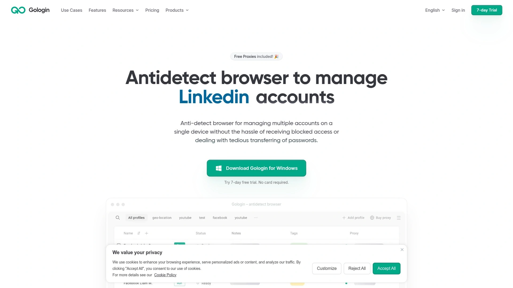

GoLogin simplifies multi-accounting without sacrificing performance. Its standout feature is the "Orbita" browser, which allows you to create unique browsing environments with ease. The platform is praised for its intuitive interface and includes helpful features like free proxy options to get users started quickly.

**Key Features:**
* Manages hundreds of browser profiles, each with a unique digital fingerprint.
* Offers a forever-free plan that includes three profiles, perfect for testing the waters.
* Provides a mobile app to manage accounts on the go.

## **[Dolphin{anty}](https://dolphin-anty.com)**

A powerful tool built specifically with the needs of digital marketers in mind, offering specialized features for automating social media and ad accounts.

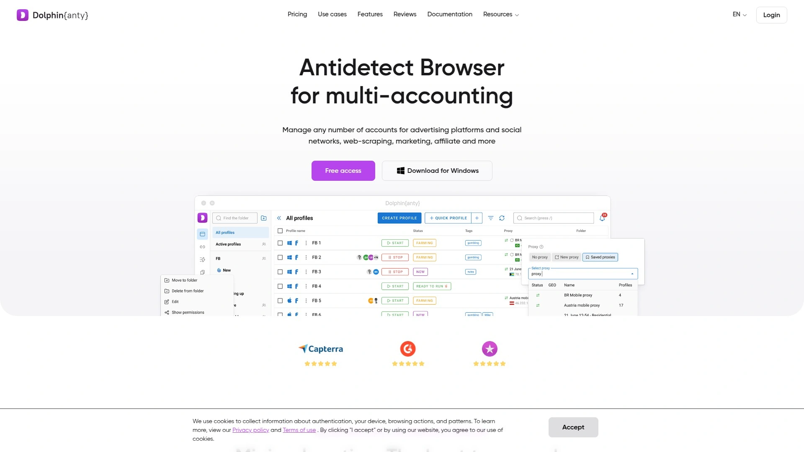

Dolphin{anty} streamlines the management of numerous accounts by focusing on efficiency. It includes a no-code automation builder that lets you create scripts for routine tasks like post scheduling and engagement, saving significant time. It's particularly popular for its bulk action capabilities, such as creating hundreds of profiles at once.

* **Built-in Automation:** Simplifies repetitive tasks on platforms like Facebook and others.
* **User-Friendly Interface:** Designed to be clean and intuitive, even for those new to anti-detect browsers.
* **Team Collaboration:** Includes features for sharing profiles and managing access levels within a team.

## **[AdsPower](https://www.adspower.com)**

A comprehensive solution for e-commerce sellers and advertising agencies, combining anti-detect browsing with powerful robotic process automation (RPA) features.

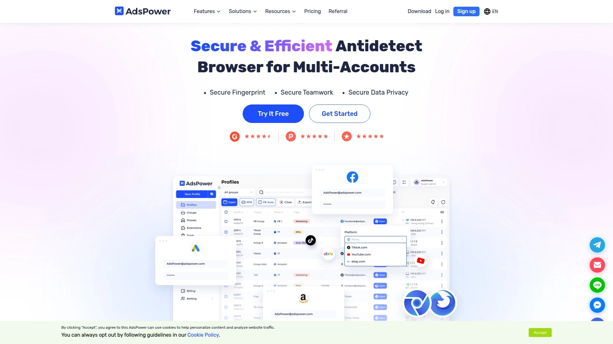

AdsPower excels at automating workflows across multiple accounts. You can set up scripts to handle everything from logging into accounts to completing purchases, all without writing a single line of code. Its browser environments are highly customizable, allowing you to tweak dozens of fingerprint parameters to create a convincing profile.

* **Best For:** E-commerce store management and running large-scale ad campaigns.
* **Core Strength:** No-code RPA for automating complex sequences of actions.
* **Team Management:** Granular controls for assigning permissions and monitoring team member activity.

## **[Incogniton](https://incogniton.com)**

An excellent choice for users who need to automate browser tasks, offering robust Selenium and Puppeteer integration for creating and managing profiles programmatically.

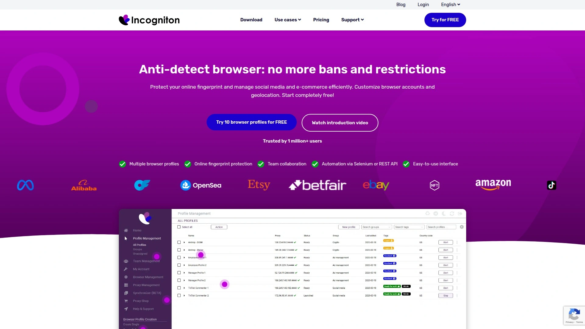

Incogniton allows you to manage multiple browser profiles from a single, clean interface. It's particularly strong for tech-savvy users who want to leverage automation, as its API is well-documented and powerful. The platform also offers a generous free starter plan that lets you save up to 10 browser profiles.

* **Automation-Friendly:** Easily integrates with popular automation libraries.
* **Bulk Profile Creator:** Quickly generate multiple profiles for large-scale projects.
* **Data Synchronization:** Syncs your profiles across different devices.

## **[Octo Browser](https://octobrowser.net)**

A fast and reliable anti-detect browser built on a custom Chromium core, designed for handling a large number of accounts without performance lags.

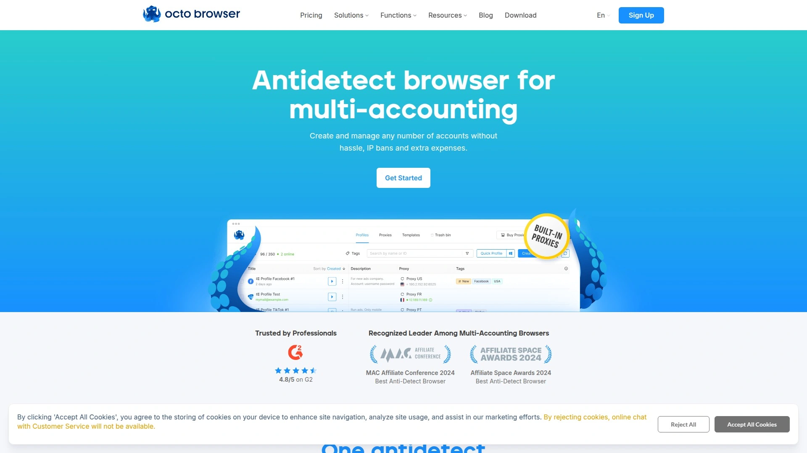

Octo Browser is engineered for speed and stability, making it ideal for tasks that require quick profile loading and smooth operation. It offers extensive fingerprint customization options and is well-suited for teamwork, with features that allow for easy profile sharing and permission management.

## **[Undetectable.io](https://undetectable.io)**

A flexible anti-detect browser that gives users deep control over fingerprint configurations and is known for its ability to generate fresh fingerprints for every session.

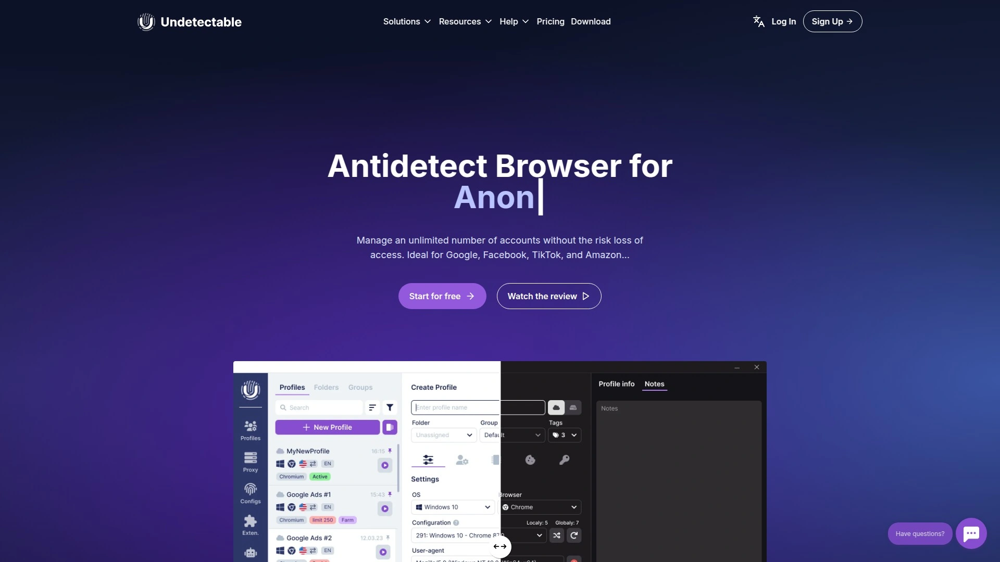

Undetectable.io is favored by users who need to create unlimited local browser profiles and have fine-grained control over their setup. It works with popular browser automation frameworks and is designed to be a versatile tool for a variety of use cases, from web scraping to account management.

## **[Kameleo](https://kameleo.io)**

A unique anti-detect tool that not only spoofs desktop browser profiles but also emulates mobile devices, including Android and iOS.

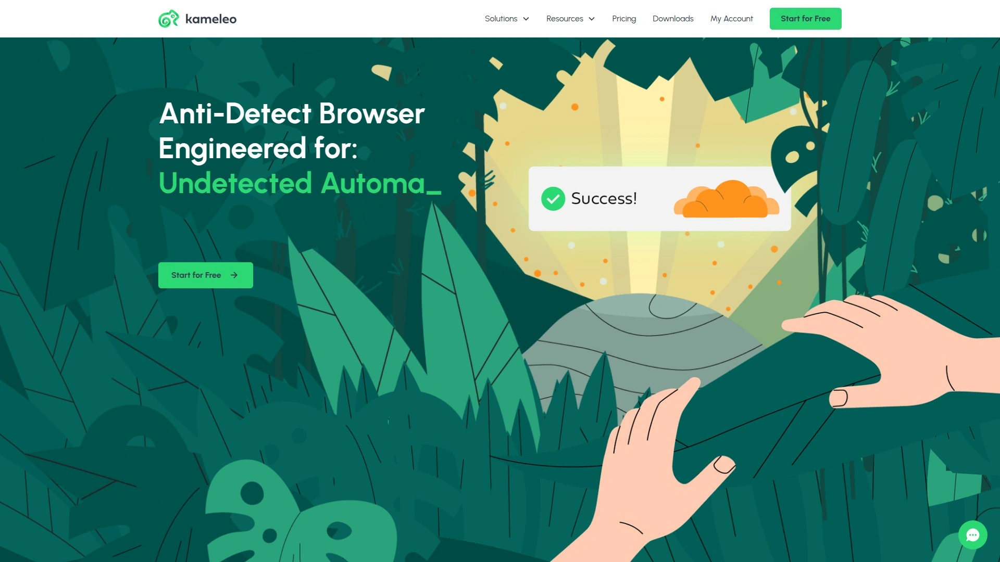

Kameleo stands out by allowing you to create virtual mobile profiles, which is essential for managing app-based platforms. It also offers unlimited local profile creation across all its plans, providing great value for users who need to manage a high volume of accounts without cloud limitations.

## **[Linken Sphere](https://ls.app)**

An anti-detect browser that prioritizes security and performance, built with an architecture that leverages C++ for speed and cloud data encryption for privacy.

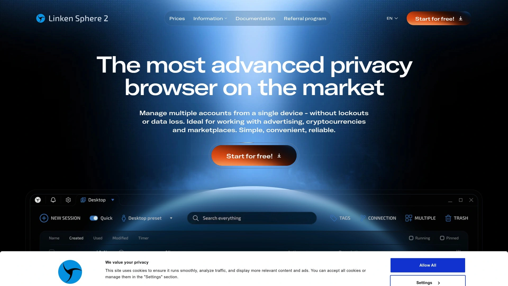

After a period of redevelopment, Linken Sphere has returned with a focus on delivering a secure and high-performance experience. It allows for flexible customization of the interface and supports the mass creation of sessions, simplifying the setup process for large-scale operations.

## **[Nstbrowser](https://www.nstbrowser.io)**

A tool designed to help users manage multiple accounts with an emphasis on creating separate and secure browsing environments.

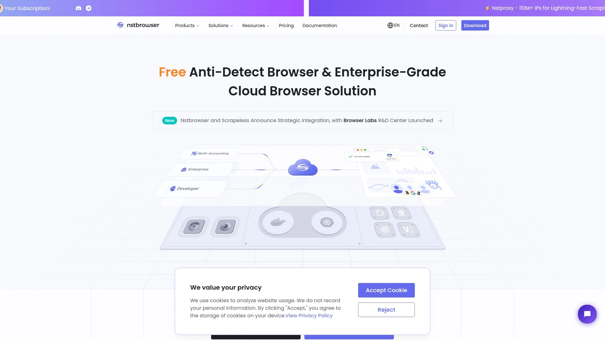

Nstbrowser offers features for creating distinct browser profiles to handle different online tasks simultaneously. It's built to help users avoid account linking and maintain their operations across various platforms.

## **[MKTLogin](https://mktlogin.com)**

An anti-detect browser focused on providing a stable and secure environment for managing multiple online accounts.

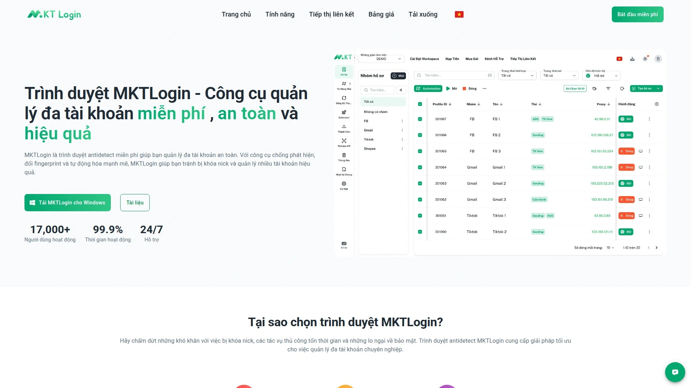

MKTLogin helps users create isolated browser profiles, each with a unique fingerprint. This is aimed at preventing websites from tracking and linking accounts, making it a useful tool for marketers and online businesses.

## **[IXBrowser](https://ixbrowser.com)**

A browser designed for multi-account management with features tailored for users in e-commerce and social media marketing.

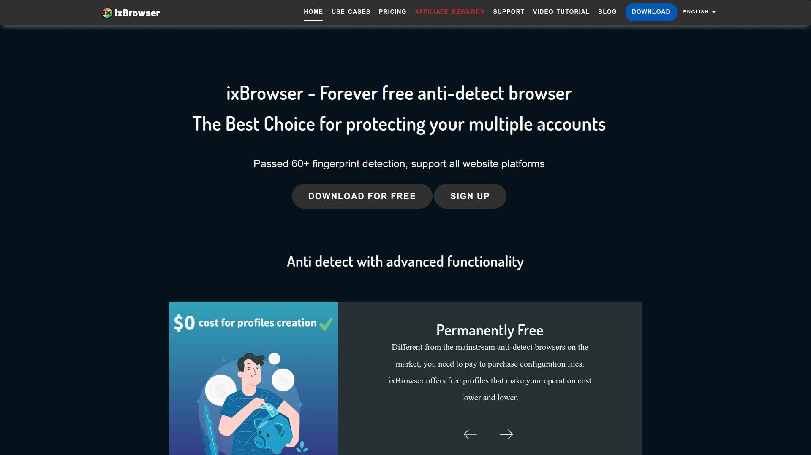

IXBrowser offers tools to create and manage separate browser profiles efficiently. It includes automation features to help streamline repetitive tasks and improve productivity when handling multiple accounts.

## **[Hidemium](https://hidemium.com/)**

A newer entrant in the anti-detect space that allows users to configure profiles with fingerprints sourced from real devices, aiming for maximum realism.

Hidemium offers both local and cloud-based profile storage and is designed to be easy to use. It's a promising option for those looking for a modern interface and effective fingerprinting technology.

## **[Geelark](https://www.geelark.com/)**

A unique solution that provides cloud-based mobile phone environments, making it ideal for tasks that require a real mobile OS rather than just a spoofed browser.

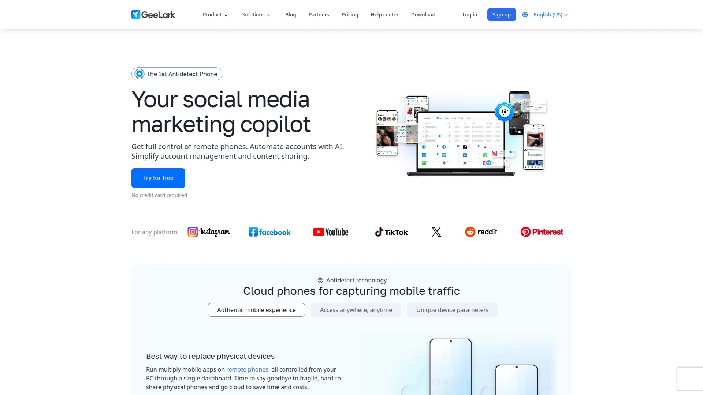

Geelark is perfect for automating app-based activities that can't be done in a standard browser. It gives you access to a virtual Android environment, opening up possibilities for mobile-first platforms.

## **[1Browser](http://www.1browser.com/)**

A budget-friendly option that provides the core functionalities of an anti-detect browser, making it a good starting point for beginners or those with minimal needs.

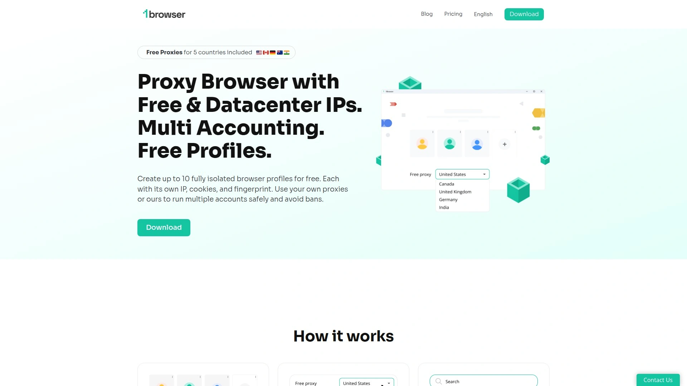

While not as feature-rich as premium alternatives, 1Browser covers the basics of creating separate browser profiles to manage a small number of accounts effectively.

## **[MarketerBrowser](http://www.marketertool.net/soft/MarketerBrowser.html)**

A tool that has been around for a while, offering multi-login capabilities for marketers managing various online accounts.

MarketerBrowser allows users to run multiple instances of a browser simultaneously, each with its own isolated set of cookies and cache, to prevent account linkage.

## **[Dicloak](https://dicloak.com/)**

An anti-detect browser that positions itself as a user-friendly alternative to more technical solutions, offering intuitive templates and no-code workflows.

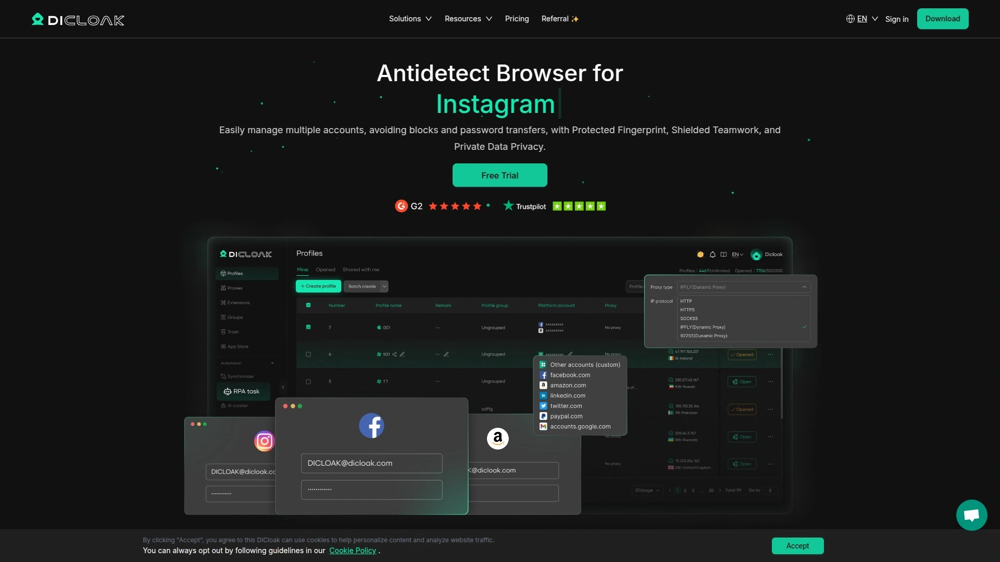

Dicloak aims to simplify the process of managing multiple accounts, especially for teams. It emphasizes ease of use and provides features that help with both security and efficiency.

## **[ClonBrowser](https://www.clonbrowser.com/)**

A browser that enables the management of hundreds of accounts from a single dashboard, with a focus on creating unique browser fingerprints for each profile.

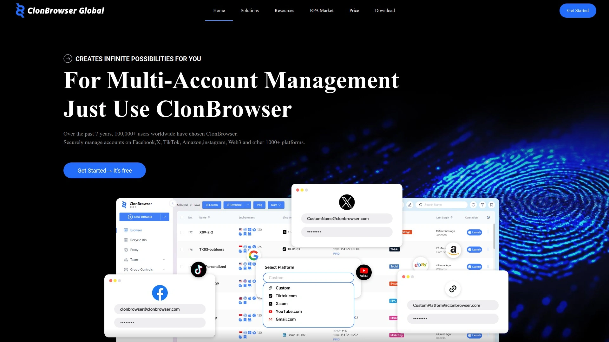

ClonBrowser is designed to protect users from browser fingerprinting and is used for tasks like e-commerce store management, social media marketing, and ad verification.

## **[VMLogin](https://www.vmlogin.com/)**

A tool that allows you to create virtual browsing profiles and run them simultaneously, effectively replacing the need for multiple computers.

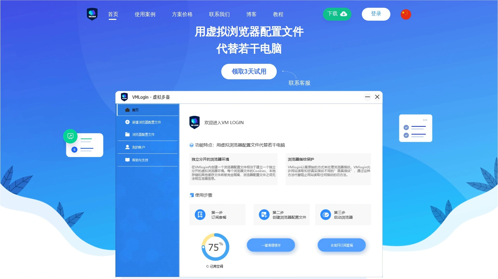

VMLogin lets you customize many parameters of your browser fingerprint, including the user agent, screen resolution, and fonts, to create a distinct online identity for each profile.

## **[Ghost Browser](https://ghostbrowser.com/)**

A Chromium-based browser designed for productivity, allowing you to log into a website with multiple accounts from one window.

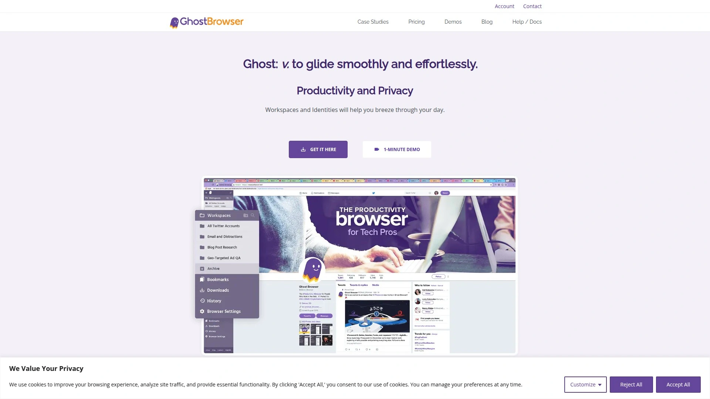

Ghost Browser is less about hiding your fingerprint and more about session management. Each tab can have its own isolated cookie jar, making it easy to switch between different accounts on the same platform without needing to log in and out.

## **[Lalicat](https://www.lalicat.com/)**

An anti-detect browser that helps users manage hundreds of accounts by providing unlimited virtual browser profiles with unique fingerprints.

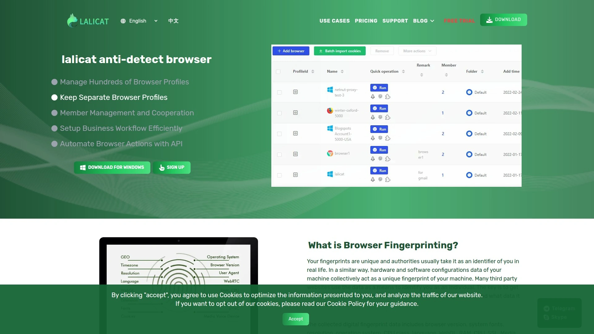

Lalicat offers features for team collaboration, allowing you to share profiles and assign permissions. It also supports automation through a local API, helping to streamline workflows.

## **[Surfinite](https://surfinite.com/)**

A cloud-based anti-detect browser that allows teams to work with multiple accounts from any device, with a focus on speed and security.

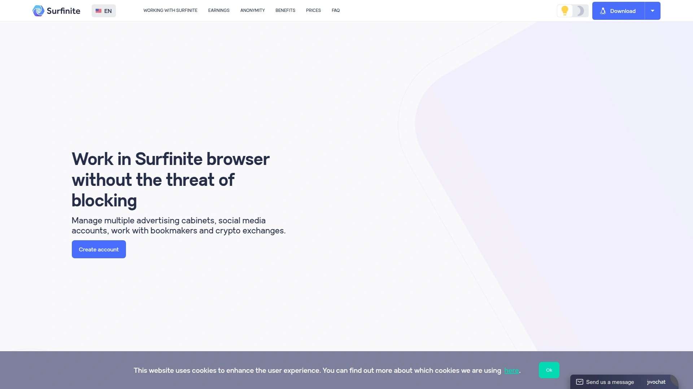

Surfinite stores all profiles in the cloud, ensuring that your data is synchronized and accessible everywhere. It’s built for collaboration and is suitable for marketing agencies and e-commerce teams.

## **[MuLogin](https://www.mulogin.com/)**

A browser that provides separate browsing environments and unique fingerprints for each account to prevent detection by online platforms.

MuLogin is used to manage accounts for e-commerce, social media, and advertising. It supports automation via Selenium and Puppeteer and includes features for teamwork.

## **[AntBrowser](https://antbrowser.pro/)**

A tool based on the Firefox browser that is designed for securely managing multiple accounts.

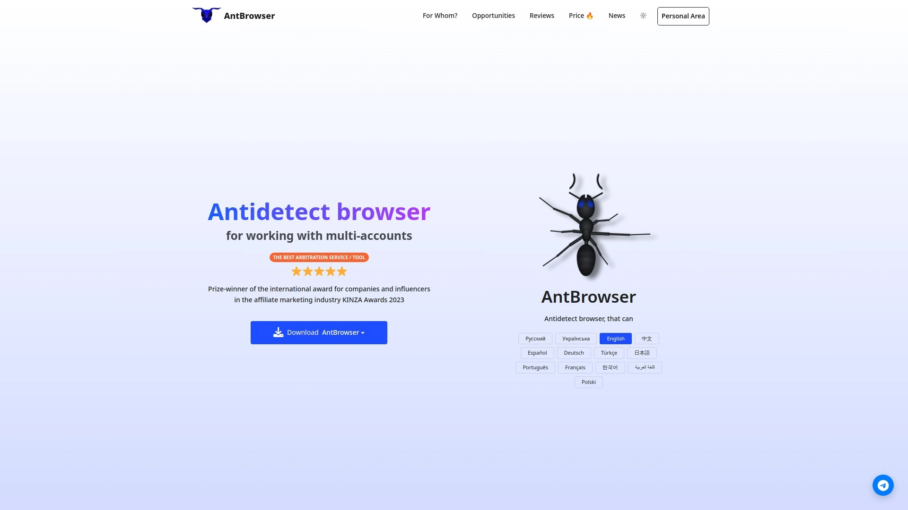

AntBrowser modifies the browser fingerprints for each profile to protect against tracking. It's a straightforward tool aimed at those who need to maintain multiple online identities for their work.

***

### FAQ

**What's the main reason to use an anti-detect browser?**
The primary purpose is to manage multiple online accounts safely by creating a unique and separate browser environment for each one. This method helps prevent platforms from linking your accounts, significantly reducing the risk of being flagged or banned, which is critical for e-commerce, social media marketing, and online research.

**Can these browsers be automated?**
Yes, most leading anti-detect browsers are designed for automation. They typically offer API access that integrates with popular frameworks like Selenium, Puppeteer, and Playwright, enabling you to automate repetitive tasks such as logging in, posting content, or gathering data.

**How do I choose the right anti-detect browser?**
Your choice should depend on your specific needs. Consider factors like your primary use case (e.g., marketing vs. data scraping), your budget, the size of your team, and any technical requirements like API access. Some tools are built for beginners with user-friendly interfaces, while others offer advanced features for large-scale enterprise operations.

***

### Conclusion

Choosing the right tool to manage your online identities is key to operating efficiently and securely. Whether you need a powerhouse for large-scale automation or a simple tool for a few accounts, this list provides a starting point for finding the perfect fit. For those focused on creating compelling content across their various accounts, [BasedLabs](https://www.basedlabs.ai) offers a unique suite of AI-powered creative tools that perfectly complements any multi-account strategy.
